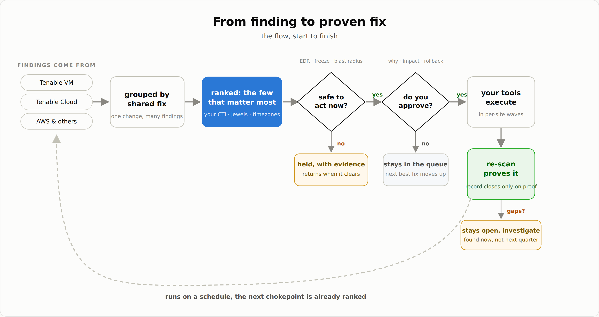

# Chokepoint Finder

**The smallest set of remediation actions that eliminates the largest share of risk,
with the evidence to defend each one.**

Security teams do not have a detection problem, they have a selection problem. A
mid-size estate carries thousands of open findings and capacity for maybe ten changes
a week. Every scanner answers "what is wrong". Chokepoint Finder is an AI security
agent that answers the question that actually decides Monday morning: **which few
changes are worth making, in what order, and how do we prove they landed.**



## The agent

Claude, equipped with the Chokepoint Finder skill and your existing MCP servers,
runs a closed loop:

1. **Gather**, read-only, through the data access you already have (a Tenable MCP
   server, the AWS MCP Server from Agent Toolkit for AWS, or exports).
2. **Collapse**: findings group by the fix they share, one patch rolled out
   fleet-wide, one base image rebuilt, one IAM role scoped, one security group
   closed, then greedy weighted max-coverage ranks the ordered shortlist. Each
   action's value is *marginal*: what it eliminates given everything ranked above
   it is already done. Overlap is priced in, never double-counted.
3. **Gate**: EDR silence on targets, change freezes, blast radius, and the CTI
   out-of-band policy (3 of 5: CVSS >= 9.5, intel score >= 95, exploited in the
   wild, externally facing, validated POC; a gov/vendor tip skips scoring). The same
   agent relays gate evidence, but anything that could widen permission is shown to a
   human with a payload digest and explicitly confirmed through a recent, one-time
   receipt; the agent cannot self-attest an all-clear.
4. **A human decides.** Every external mutation needs its own explicit approval:
   opening the change ticket, notifying a SOC or opening a hunt ticket, launching
   a scan, and any infrastructure change all count. The agent shows the why, the
   blast radius, the rollback, and refuses what is unsafe: a server under active
   attack does not get patched over.
5. **Hand the approved manifest to your executor**, which uses your own tools over MCP:
   ticketing first, then AWS changes
   through the AWS MCP Server from Agent Toolkit for AWS, patch rollouts in
   per-site waves, and image rebuilds through your CI/CD. Out-of-band items also
   hand IOCs to SOC automation and TTPs to
   threat hunt.
6. **Prove it**: re-scan (launching that scan is an approved step too), diff, and
   only then let the change record close. "We fixed it" is a claim; the delta is
   evidence. Then the loop repeats on a schedule.

The agent has no external write tools. Its permitted state changes are confined to the
Chokepoint Finder MCP process: ingesting a baseline, ranking, relaying gated evidence,
and recording proof. Your separately authorized tools act; you approve.

## Install

Claude Code discovers subagents from `<project-root>/.claude/agents/` and
`~/.claude/agents/` only. A clone nested inside another project (say
`your-project/chokepoint-finder/`) is **not** discovered — the agent would
silently not exist. Two installs that work:

**Option 1 — open this repo as the project** (fastest first run):

```bash
git clone https://github.com/tarhou/chokepoint-finder.git
cd chokepoint-finder
claude    # the subagent loads from .claude/agents/chokepoint-finder.md
```

**Option 2 — install user-wide**, available in every project:

```bash
git clone https://github.com/tarhou/chokepoint-finder.git
cd chokepoint-finder
mkdir -p ~/.claude/agents ~/.claude/skills/chokepoint-finder
cp .claude/agents/chokepoint-finder.md ~/.claude/agents/
cp -R .claude/skills/chokepoint-finder/. ~/.claude/skills/chokepoint-finder/
```

The second copy places the bundled skill (and its ranking script) at
`~/.claude/skills/chokepoint-finder/`, where Claude Code discovers personal
skills; the agent needs `scripts/chokepoint.py` on disk wherever it runs. To
install for a single project instead, run the same `mkdir`/`cp` commands with
`<your-project>/.claude/` in place of `~/.claude/`.

Then ask Claude "what should we fix first?"

What's here:

- `.claude/agents/chokepoint-finder.md` — the agent definition: its operating loop
  and hard rules. Claude Code loads it as a subagent; Cowork reads it as the agent.
- `.claude/skills/chokepoint-finder/` — a discoverable vendored copy of the
  Chokepoint Finder skill (instructions plus the
  dependency-free ranking script), bundled so the agent is self-contained; the
  canonical copy lives at
  [chokepoint-finder-skill](https://github.com/tarhou/chokepoint-finder-skill).
- `AGENTS.md` — the short operator's guide.

See the engine work with zero setup:

```bash
python3 .claude/skills/chokepoint-finder/scripts/chokepoint.py --demo
```

## The family

| Repo | What it is |
|------|-----------|
| [chokepoint-finder-skill](https://github.com/tarhou/chokepoint-finder-skill) | The product. Copy into Claude, zero third-party dependencies, works with your existing MCPs. Includes a standard-library ranking script. |
| [chokepoint-finder-playbook](https://github.com/tarhou/chokepoint-finder-playbook) | The chain: eight stages, explicit owners and handoffs, a human checkpoint in the middle. |
| [chokepoint-finder-mcp](https://github.com/tarhou/chokepoint-finder-mcp) | The engine: a FastMCP server with ten tools, a deterministic demo estate, Tenable and AWS collectors, evidence relayed in from your other MCP servers, and a fail-closed safety model asserted by its test suite. |

Start with the skill. Add the server when you want precise, repeatable tooling.

## Limitations

This is a decision layer, not an unattended automation: per-step human approval is
a design requirement, not an option. Ranking quality tracks metadata quality. Demo
data across the family is synthetic and its numbers illustrative.

Authors: Zane K ([@zkilling](https://github.com/zkilling)), Tarek H ([@tarhou](https://github.com/tarhou)). MIT license.
